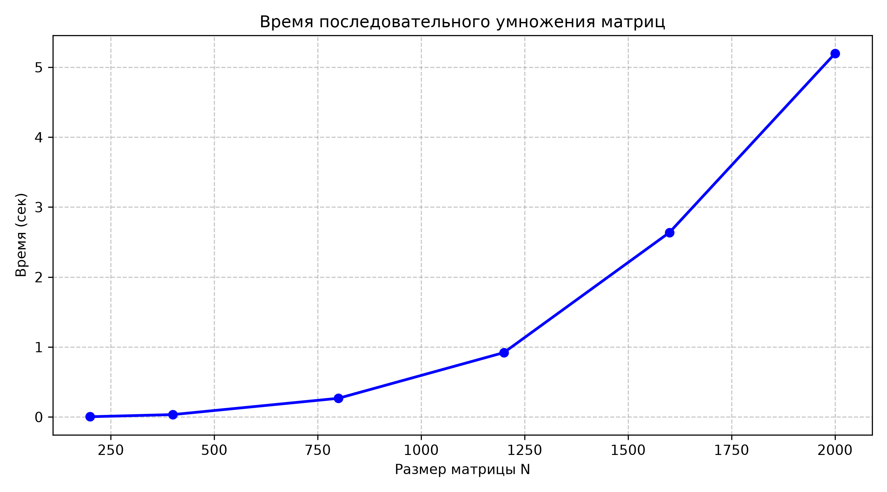

# Лабораторная работа №1: Последовательное умножение квадратных матриц

## 1. Цель работы
Реализация базового однопоточного алгоритма перемножения двух плотных квадратных матриц на языке C++, замер временных характеристик при различных объемах входных данных и автоматическая верификация результатов с помощью библиотеки NumPy.

## 2. Аппаратное и программное обеспечение
* **Процессор:** AMD Ryzen 7 8845H
* **Оперативная память:** 32 ГБ LPDDR5 7500МТ/c
* **Операционная система:** Windows 11 (64-bit)
* **Компилятор:** MSVC
* **Флаги компиляции:** `/O2 /std:c++17`

## 3. Описание реализации
Алгоритм реализован классическим методом с тремя вложенными циклами. 
Для минимизации промахов кэш-памяти (Cache Misses) использован порядок обхода циклов **i-k-j** вместо наивного **i-j-k**. При таком порядке данные из матрицы $B$ считываются последовательно по строкам (пространственная локализация), что позволяет процессору эффективно задействовать кэш-линии L1/L2.

Двумерные матрицы развернуты в непрерывные одномерные массивы `std::vector<double>` размером $N^2$.

## 4. Результаты экспериментов

### Исходные данные замеров

| Размер матрицы (N) | Количество операций (FLOP) | Время выполнения (сек) |
|:------------------:|:--------------------------:|:----------------------:|
| 200                | 1.60e+07                   | 0.0039                 |
| 400                | 1.28e+08                   | 0.0332                 |
| 800                | 1.02e+09                   | 0.3415                 |
| 1200               | 3.46e+09                   | 0.8799                 |
| 1600               | 8.19e+09                   | 2.2589                 |
| 2000               | 1.60e+10                   | 5.6739                 |

### График зависимости времени от размера матрицы

## 5. Верификация
Корректность работы подтверждена скриптом `common/verify.py`. 
Результат перемножения на C++ поэлементно сравнивался с результатом операции `@` (`np.matmul`) из библиотеки NumPy с допустимой относительной и абсолютной погрешностью `1e-5`. На всех размерностях статус верификации: **OK**.

## 6. Выводы
1. Вычислительная сложность классического алгоритма составляет $O(N^3)$. Экспериментальный график подтверждает кубический рост времени: при увеличении размера матрицы в 2 раза (с 800 до 1600) время выполнения возрастает приблизительно в 8 раз ($2^3 = 8$).
2. На размерностях до 400 время работы мало и подвержено системным шумам ОС. Начиная с $N = 800$, объем вычислений ($>10^9$ FLOP) обеспечивает стабильные результаты замеров.
3. Полученные временные показатели будут использованы в лабораторной работе №2 в качестве базы (baseline $T_1$) для расчета ускорения ($S = T_1 / T_p$) и эффективности ($E = S / p$) многопоточной версии на базе OpenMP.
