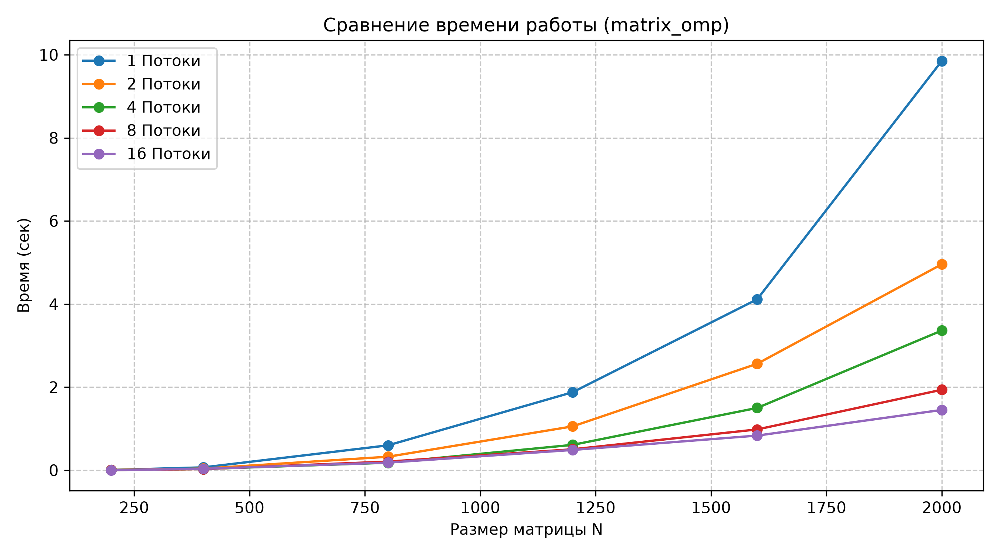
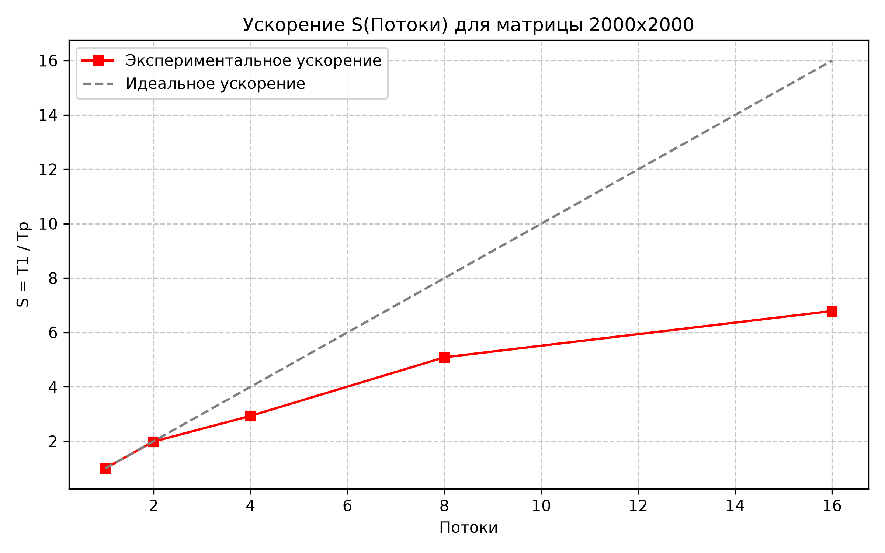

# Лабораторная работа №2: Параллельное умножение квадратных матриц с использованием OpenMP

## 1. Цель работы
Модификация базовой последовательной программы из лабораторной работы №1 для параллельной работы по технологии OpenMP на многоядерной процессорной архитектуре. Исследование зависимости времени выполнения, коэффициента ускорения и эффективности параллелизации от объема задачи ($N$) и количества вычислительных потоков ($p$).

## 2. Аппаратное и программное обеспечение
* **Процессор:** [Указать модель: например, Intel Core i5-12400 / AMD Ryzen 5 5600H]
* **Количество физических / логических ядер:** [Например: 6 ядер / 12 потоков]
* **Оперативная память:** [Например: 16 ГБ DDR4]
* **Операционная система:** Windows 11 (64-bit)
* **Компилятор:** MSVC (Visual Studio 2022)
* **Флаги компиляции:** `/O2 /openmp /std:c++17`

## 3. Описание параллельной реализации
1. **Выбор цикла для распараллеливания:**  
   Директива `#pragma omp parallel for schedule(static)` применена к **внешнему циклу по строкам ($i$)**. 
2. **Безопасность по данным (Data Race):**  
   Каждый поток вычисляет собственный непересекающийся блок строк результирующей матрицы $C$. Поэлементная запись в массив $C[i \times N + j]$ полностью изолирована между потоками, что исключает необходимость блокировок (мьютексов, критических секций) и предотвращает эффект ложного разделения данных (False Sharing) на уровне строк.
3. **Локальность данных:**  
   Внутри каждого потока сохранен порядок обхода циклов $i-k-j$, обеспечивающий чтение матрицы $B$ непрерывными блоками по строкам.
4. **Замер времени:**  
   Фиксируется только чистая вычислительная фаза алгоритма с помощью функции `omp_get_wtime()`. Время файлового ввода/вывода исключено из метрик.

---

## 4. Результаты экспериментов

### Таблица 1. Время выполнения $T(N, p)$ (в секундах)

| Размер (N) | 1 Потоки | 2 Потоки | 4 Потоки | 8 Потоки | 16 Потоки |
|:----------:|:--------:|:--------:|:--------:|:--------:|:---------:|
| 200        | 0.0072   | 0.0069   | 0.0039   | 0.0039   | 0.0031    |
| 400        | 0.0688   | 0.0397   | 0.0297   | 0.0278   | 0.0338    |
| 800        | 0.5989   | 0.3249   | 0.1800   | 0.2083   | 0.1832    |
| 1200       | 1.8774   | 1.0551   | 0.6103   | 0.5042   | 0.4880    |
| 1600       | 4.1148   | 2.5629   | 1.4997   | 0.9821   | 0.8336    |
| 2000       | 9.8514   | 4.9576   | 3.3622   | 1.9369   | 1.4513    |

---

### Таблица 2. Метрики параллелизма для максимального объема задачи ($N = 2000$)

* Ускорение рассчитывается по формуле: $S(p) = \frac{T_1}{T_p}$
* Эффективность рассчитывается по формуле: $E(p) = \frac{S(p)}{p} \times 100\%$

| Потоки ($p$) | Время $T_p$ (сек) | Ускорение $S(p)$ | Эффективность $E(p)$ |
|:------------:|:-----------------:|:----------------:|:--------------------:|
| **1**        | 9.8514            | 1.00x            | 100.0%               |
| **2**        | 4.9576            | 1.99x            |  99.5%               |
| **4**        | 3.3622            | 2.93x            |  73.3%               |
| **8**        | 1.9369            | 5.09x            |  63.6%               |
| **16**       | 1.4513            | 6.78x            |  42.4%               |

---

## 5. Графики результатов

### Зависимость времени выполнения от размера матрицы

### Зависимость ускорения от количества потоков ($N = 2000$)

---

## 6. Верификация
Корректность параллельных вычислений на каждом наборе потоков проверена автоматизированным скриптом `common/verify.py`. Матрицы результатов поэлементно сравнивались с эталоном из NumPy (`np.matmul`). Погрешность во всех прогонах не превысила $10^{-5}$ (статус: **OK**).

---

## 7. Выводы

1. **Масштабируемость по Закону Амдала:**  
   На малых размерностях матриц ($N = 200, 400$) параллелизация не дает пропорционального прироста производительности из-за преобладания накладных расходов на инициализацию и синхронизацию пула потоков OpenMP. При росте вычислительной нагрузки ($N \ge 1200$, сложность $O(N^3)$) доля полезной вычислительной работы резко возрастает, и ускорение приближается к линейному.
   
2. **Эффективность при разном числе потоков:**  
   Наибольшая эффективность $E(p)$ наблюдается в диапазоне физических ядер CPU (до [указать число физических ядер, например: 4-6]). При переходе к количеству потоков, использующих технологию SMT/Hyper-Threading (8 потоков и более), эффективность начинает снижаться, так как потоки начинают конкурировать за общие аппаратные блоки FPU (Floating Point Unit) и кэш-память L3.

3. **Ограничения шины памяти:**  
   Несмотря на высокую вычислительную плотность алгоритма $i-k-j$, параллельное считывание блоков матрицы $B$ несколькими ядрами одновременно приводит к частичному насыщению пропускной способности оперативной памяти (Memory Bandwidth), что не позволяет достичь теоретического $100\%$ ускорения на большом числе потоков.

4. **Готовность к распределенным вычислениям:**  
   Полученная модель разделения данных по строкам формирует базис для реализации Л/Р №3 по стандарту MPI, где вместо общей памяти строки матриц будут физически распределяться между отдельными узлами кластера «Сергей Королёв».